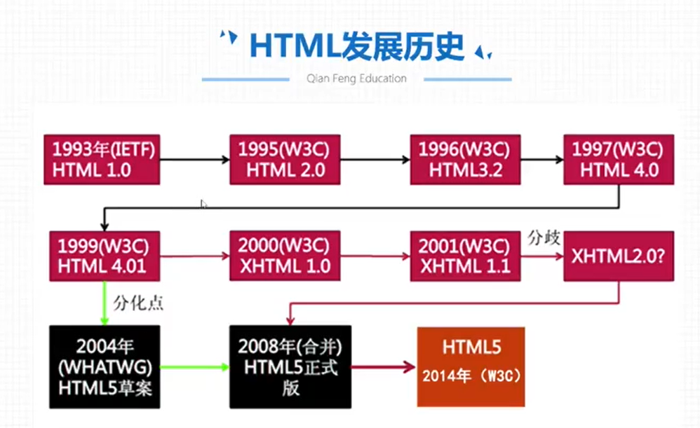
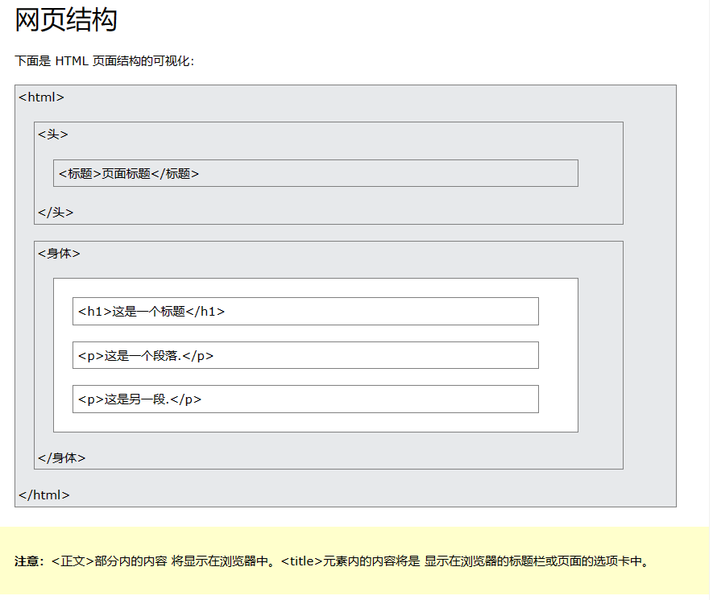

# H5-Concept

## 目录

-   [Web标准](#Web标准)
-   [相关概念](#相关概念)
-   [基本结构](#基本结构)
-   [文档类型](#文档类型)
-   [标签语法](#标签语法)

> 基本概念

# Web标准

> 📌web标准包含了三个方面：结构（html）, 表现（css）, 行为（JavaScript简称js）

-   HTML结构层: 一些标签语句
-   CSS样式层: 主要的作用就是对标签结构的修饰
-   JS行为交互层: 对于我们的页面结构的动态交互,添加效果

注：

-   w3c——( World Wide Web Consortium )万维网联盟，创建于1994年是Web技术领域最具权威和影响力的国际中立性技术标准机构。（制定了xhtml和xml css的相关标准 非盈利性质）
-   ECMA——(European Computer Manufactures Association) 欧洲电脑场商联合会。（制定了DOM文档对象模型，ECMAScrpipt标准）



# 相关概念

超文本标记语言（英语：HyperText Markup Language，简称：HTML）是一种用来结构化 Web 网页及其内容的标记语言，不是一门编程语言而是一种用来告知浏览器如何组织页面的标记语言。

HTML5====超文本标记语言的第五个版本(hyper text markup language 5)

-   HTML 代表 超文本标记语言
-   HTML 是用于创建网页的标准标记语言
-   HTML 描述网页的结构
-   HTML 由一系列元素组成
-   HTML 元素告诉浏览器如何显示内容
-   HTML 元素标记内容片段，例如“这是一个标题”、“这个 是一个段落“，”这是一个链接“等。

H5=======技术里面包含了HTML,CSS,以及js里面新增的一些API

目前来看,HTML5和H5不能作为等价对比

# 基本结构



HTML的基本解构包括`<!DOCTYPE>`声明、`<html>`元素、`<head>`元素和`<body>`元素。以下是每个部分的解释：

-   `<!DOCTYPE>`声明：位于HTML文档的开头，用于指示文档使用的HTML版本。例如，`<!DOCTYPE html>`表示使用HTML5进行标记。
-   `<html>`元素：表示HTML文档的根元素，包含了整个HTML文档的内容。
-   `<head>`元素：用于定义文档的头部，包含了文档的元数据（metadata），如标题（`<title>`）、字符集声明（`<meta charset="UTF-8">`）、外部样式表（`<link rel="stylesheet" type="text/css" href="styles.css">`）等。
-   `<body>`元素：用于定义文档的主体内容，包含了显示在浏览器窗口中的实际内容，如标题、段落、图片、链接、表格等。

下面是一个完整的HTML基本结构示例：

```html
<!DOCTYPE html>
<html>
<head>
  <meta charset="UTF-8">
  <title>我的网页</title>
  <link rel="stylesheet" type="text/css" href="styles.css">
</head>
<body>
  <h1>欢迎来到我的网页</h1>
  <p>这是一个简单的示例。</p>
  
  <a href="https://example.com">点击这里</a>访问外部链接。
</body>
</html>
```

这是HTML的基本结构，其中`<head>`和`<body>`部分是必须的，而`<!DOCTYPE>`声明和`<html>`元素是一个HTML文档必备的起始部分。在`<head>`中定义的元数据用于配置文档的各种属性和样式，而`<body>`中的内容是最终要在浏览器中显示的页面主体内容。

# 文档类型

声明表示文档类型，并帮助浏览器正确显示网页。`<!DOCTYPE>`

它只能出现在页面顶部（在任何 HTML 标记之前）一次。

声明不区分大小写。`<!DOCTYPE>`

HTML5 的声明是：`<!DOCTYPE>`

```html
<!DOCTYPE html>
```

# 标签语法

-   常规标记(双标记)

> 📌语法：<标记 属性= "属性值"  属性="属性值">文本内容\</标记>

```html
<h1 class="tit">hello world</h1>
<h1 align="center">你好 世界 </h1>

```

-   空标记（单标记）

> 📌语法：<标记 属性 = "属性值"  属性="属性值"/>

```html
<input type="text">
```

特点:

-   所有的标签都放在<>
-   都可以带属性也都可以不带属性,可以带一个可以带多个
-   属性没有先后顺序
-   属性和属性值使用=链接; 属性值需要带引号
-   标签名字和第一组属性必须带空格; 每一组属性和属性值之间必须带空格隔开
-   双标签必须带结束标记

注意:

-   放在标签里面的属性被称之为标签属性
-   属性:对于一个事物的描述身高;    体重      性别
-   属性值:就是这个描述的取值:180cm   100斤    男
