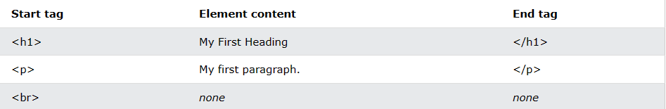

# H5-Elements&#x20;

## 目录

-   [基本元素](#基本元素)
-   [嵌套元素](#嵌套元素)
-   [示例说明](#示例说明)
-   [结束标签](#结束标签)
-   [空的元素](#空的元素)
-   [不大小写](#不大小写)

| Start tag | Element content     | End tag |
| --------- | ------------------- | ------- |
| \<h1>     | My First Heading    | \</h1>  |
| \<p>      | My first paragraph. | \</p>   |
|           | *none*              | *none*  |

# 基本元素

The HTML **element** is everything from the start tag to the end tag:

HTML元素是从开始标签到结束标签的所有内容：

```html
<tagname>Content goes here...</tagname>
```

Examples of some HTML elements:

一些HTML元素的例子：

```html
<h1>My First Heading</h1>
```

```html
<p>My first paragraph.</p>
```



> **Note:** Some HTML elements have no content (like the \<br> element). These elements are called empty elements. Empty elements do not have an end tag!

# 嵌套元素

HTML elements can be nested (this means that elements can contain other elements).

HTML元素可以嵌套（这意味着元素可以包含其他元素）。

All HTML documents consist of nested HTML elements.

所有HTML文档都由嵌套的HTML元素组成。

The following example contains four HTML elements (`<html>`, `<body>`, `<h1>` and `<p>`):

以下示例包含四个HTML元素（ `<html>` 、 `<body>` 、 `<h1>` 和 `<p>` ）：

```html
<!DOCTYPE html>  
<html>  

<body>  

<h1>My First Heading</h1>  

<p>My first paragraph.</p>  

</body>  

</html>

```

# 示例说明

The `<html>` element is the root element and it defines the whole HTML document.

`<html>` 元素是根元素，它定义了整个HTML文档。

It has a start tag `<html>` and an end tag `</html>`.

它有一个开始标签 `<html>` 和一个结束标签 `</html>` 。

Then, inside the `<html>` element there is a `<body>` element:

然后，在 `<html>` 元素中有一个 `<body>` 元素：

```html
<body>

<h1>My First Heading</h1>
<p>My first paragraph.</p>

</body>
```

The `<body>` element defines the document's body.

`<body>` 元素定义文档的主体。

It has a start tag `<body>` and an end tag `</body>`.

它有一个开始标签 `<body>` 和一个结束标签 `</body>`

Then, inside the `<body>` element there are two other elements: `<h1>` and `<p>`:

然后，在 `<body>` 元素中有两个其他元素： `<h1>` 和 `<p>` ：

```html
<h1>My First Heading</h1>
<p>My first paragraph.</p>
```

The `<h1>` element defines a heading.

\<h1> 元素定义了一个标题

It has a start tag `<h1>` and an end tag `</h1>`:

它有一个开始标签 `<h1>` 和一个结束标签 `</h1>` ：

```html
<h1>My First Heading</h1>

```

The `<p>` element defines a paragraph.

`<p>` 元素定义了一个段落。

It has a start tag `<p>` and an end tag `</p>`:

它有一个开始标签 `<p>` 和一个结束标签 `</p>` ：

```html
<p>My first paragraph.</p>
```

# 结束标签

Some HTML elements will display correctly, even if you forget the end tag:

即使您忘记了结束标记，一些HTML元素也会正确显示：

```html
<html>
<body>

<p>This is a paragraph
<p>This is a paragraph

</body>
</html>
```

> 📌However, never rely on this! Unexpected results and errors may occur if you forget the end tag!**但是，永远不要依赖这个！如果忘记结束标记，可能会出现意外结果和错误！**

# 空的元素

HTML elements with no content are called empty elements.

没有内容的HTML元素称为空元素。

The `<br>` tag defines a line break, and is an empty element without a closing tag:

`<br>` 标签定义了一个换行符，并且是一个没有结束标签的空元素：

```html
<p>This is a <br> paragraph with a line break.</p>
```

# 不大小写

HTML tags are not case sensitive: `<P>` means the same as `<p>`.

HTML标签不区分大小写： `<P>` 与 `<p>` 相同。

The HTML standard does not require lowercase tags, but W3C **recommends** lowercase in HTML, and **demands** lowercase for stricter document types like XHTML.

HTML标准不需要小写标记，但是W3C推荐HTML中使用小写标记，并且对于更严格的文档类型（如XHTML）要求小写标记。

At W3Schools we always use lowercase tag names.

在W3Schools，我们总是使用小写的标签名称。
