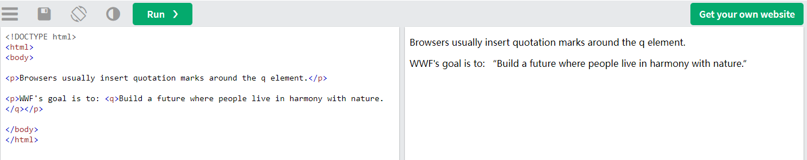
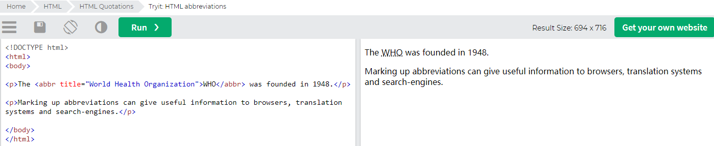
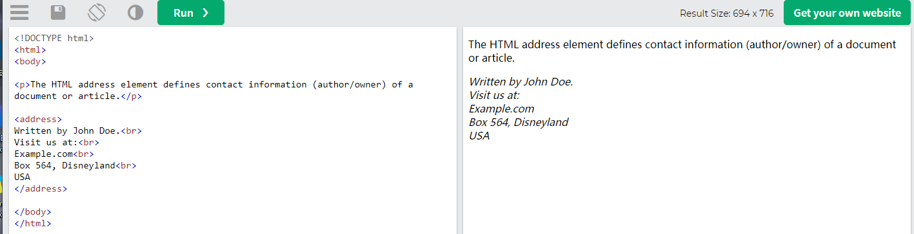
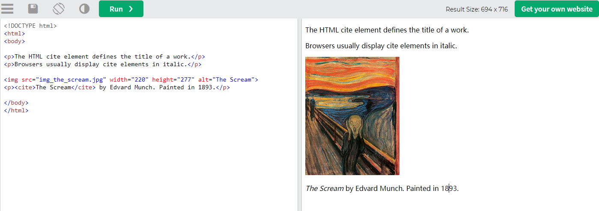
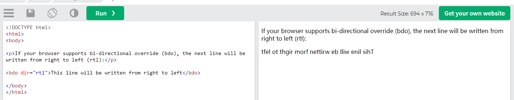

# H5-Quotation

## 目录

-   [\<blockquote>](#blockquote)
-   [\<q> ](#q-)
-   [\<abbr>](#abbr)
-   [\<address> ](#address-)
-   [\<cite>](#cite)
-   [\<bdo>](#bdo)

> 📌HTML引用和引文元素

| Tag                                                                               | Description                                                    |
| --------------------------------------------------------------------------------- | -------------------------------------------------------------- |
| [\<abbr>](https://www.w3schools.com/tags/tag_abbr.asp "<abbr>")                   | Defines an abbreviation or acronym                             |
| [\<address>](https://www.w3schools.com/tags/tag_address.asp "<address>")          | Defines contact information for the author/owner of a document |
| [\<bdo>](https://www.w3schools.com/tags/tag_bdo.asp "<bdo>")                      | Defines the text direction                                     |
| [\<blockquote>](https://www.w3schools.com/tags/tag_blockquote.asp "<blockquote>") | Defines a section that is quoted from another source           |
| [\<cite>](https://www.w3schools.com/tags/tag_cite.asp "<cite>")                   | Defines the title of a work                                    |
| [\<q>](https://www.w3schools.com/tags/tag_q.asp "<q>")                            | Defines a short inline quotation                               |

# `<blockquote>`

> 📌HTML引用

The HTML `<blockquote>` element defines a section that is quoted from another source.HTML&#x20;

`<blockquote>` 元素定义了一个引用自另一个源的部分。

Browsers usually indent `<blockquote>` elements.

浏览器通常缩进 `<blockquote>` 元素。

```html
<p>Here is a quote from WWF's website:</p>
<blockquote cite="http://www.worldwildlife.org/who/index.html">
For 60 years, WWF has worked to help people and nature thrive. As the world's leading conservation organization, WWF works in nearly 100 countries. At every level, we collaborate with people around the world to develop and deliver innovative solutions that protect communities, wildlife, and the places in which they live.
</blockquote>
```

# `<q> `

> 📌HTML短引号

The HTML `<q>` tag defines a short quotation.

HTML `<q>` 标签定义了一个短引号。

Browsers normally insert quotation marks around the quotation. &#x20;
浏览器通常在引号周围插入引号。

```html
<p>WWF's goal is to: <q>Build a future where people live in harmony with nature.</q></p>
```



# `<abbr>`

> 📌HTML缩略语，等同于alt或者title

The HTML `<abbr>` tag defines an abbreviation or an acronym, like "HTML", "CSS", "Mr.", "Dr.", "ASAP", "ATM".

HTML `<abbr>` 标签定义了缩写或首字母缩略词，如“HTML”、“CSS”、“Mr.”，“博士。“，“尽快”，“自动取款机”。

Marking abbreviations can give useful information to browsers, translation systems and search-engines. &#x20;

标记缩写可以为浏览器、翻译系统和搜索引擎给予有用的信息。

**Tip:** Use the global title attribute to show the description for the abbreviation/acronym when you mouse over the element. 

提示：当您将鼠标移到元素上时，使用全局title属性来显示缩写/首字母缩略词的描述。

```html
<p>The <abbr title="World Health Organization">WHO</abbr> was founded in 1948.</p>
```



# `<address> `

> 📌HTML联系信息

The HTML `<address>` tag defines the contact information for the author/owner of a document or an article.

HTML `<address>` 标签定义了文档或文章的作者/所有者的联系信息。

The contact information can be an email address, URL, physical address, phone number, social media handle, etc. &#x20;

联系信息可以是电子邮件地址、URL、物理地址、电话号码、社交媒体句柄等。

The text in the `<address>` element usually renders in *italic,* and browsers will always add a line break before and after the `<address>` element.

`<address>` 元素中的文本通常以斜体显示，浏览器总是在 `<address>` 元素前后添加换行符。

```html
<address>
Written by John Doe.<br>
Visit us at:<br>
Example.com<br>
Box 564, Disneyland<br>
USA
</address>
```



# `<cite>`

> 📌HTML工作标题

The HTML `<cite>` tag defines the title of a creative work (e.g. a book, a poem, a song, a movie, a painting, a sculpture, etc.).

HTML `<cite>` 标签定义了一个创造性作品的标题（例如：一本书、一首诗、一首歌、一部电影、一幅画、一座雕塑等）。

**Note:** A person's name is not the title of a work.

注：人名不是作品的名称。

The text in the `<cite>` element usually renders in *italic*.

`<cite>` 元素中的文本通常以斜体显示。

```html
<p><cite>The Scream</cite> by Edvard Munch. Painted in 1893.</p>
```



# `<bdo>`

> 📌HTML双向覆盖

BDO stands for Bi-Directional Override. &#x20;

BDO是Bi-Directional Override的缩写。

The HTML `<bdo>` tag is used to override the current text direction:

HTML `<bdo>` 标签用于覆盖当前文本方向：

```html
<bdo dir="rtl">This text will be written from right to left</bdo>
```


