# H5-Color

## 目录

-   [Color Names](#Color-Names)
-   [Background Color](#Background-Color)
-   [Text Color](#Text-Color)
-   [Border Color](#Border-Color)
-   [Color Values](#Color-Values)
    -   [RGB](#RGB)
        -   [RGB Color Values](#RGB-Color-Values)
        -   [Shades of Gray](#Shades-of-Gray)
        -   [RGBA Color Values](#RGBA-Color-Values)
    -   [HEX](#HEX)
        -   [HEX Color Values](#HEX-Color-Values)
        -   [Shades of Gray](#Shades-of-Gray)
    -   [HSL](#HSL)
        -   [HSL Color Values](#HSL-Color-Values)
        -   [Saturation](#Saturation)
        -   [Lightness](#Lightness)
        -   [Shades of Gray](#Shades-of-Gray)
        -   [HSLA Color Values](#HSLA-Color-Values)

> 📌HTML颜色

|                  |      |
| ---------------- | ---- |
| Color Names      | 颜色名字 |
| Background Color | 背景颜色 |
| Text Color       | 文本颜色 |
| Color Value      | 颜色值  |

HTML colors are specified with predefined color names, or with RGB, HEX, HSL, RGBA, or HSLA values. &#x20;

HTML颜色使用预定义的颜色名称或RGB、HEX、HSL、RGBA或HSLA值指定。

# `Color Names`

> 📌HTML颜色名称

In HTML, a color can be specified by using a color name: &#x20;

在HTML中，可以使用颜色名称来指定颜色：

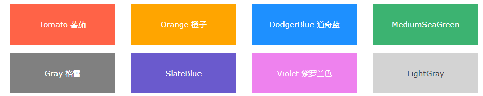

# `Background Color`

> 📌HTML背景颜色

You can set the background color for HTML elements: &#x20;

您可以设置HTML元素的背景颜色：

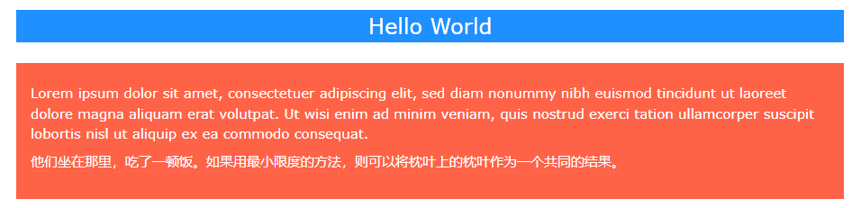

```html
<h1 style="background-color:DodgerBlue;">Hello World</h1>
<p style="background-color:Tomato;">Lorem ipsum...</p>
```

# `Text Color`

> 📌HTML文本颜色

You can set the color of text: &#x20;

您可以设置文本的颜色：

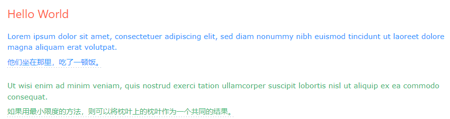

```html
<h1 style="color:Tomato;">Hello World</h1>
<p style="color:DodgerBlue;">Lorem ipsum...</p>
<p style="color:MediumSeaGreen;">Ut wisi enim...</p>
```

# `Border Color`

> 📌HTML边框颜色

You can set the color of borders: &#x20;

您可以设置边框的颜色：

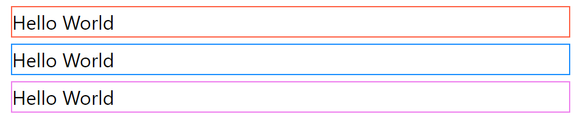

```html
<h1 style="border:2px solid Tomato;">Hello World</h1>
<h1 style="border:2px solid DodgerBlue;">Hello World</h1>
<h1 style="border:2px solid Violet;">Hello World</h1>
```

# `Color Values`

> 📌HTML颜色值

In HTML, colors can also be specified using RGB values, HEX values, HSL values, RGBA values, and HSLA values. &#x20;

在HTML中，还可以使用RGB值、HEX值、HSL值、RGBA值和HSLA值来指定颜色。

The following three \<div> elements have their background color set with RGB, HEX, and HSL values: &#x20;

以下三个元素的背景颜色设置为RGB、HEX和HSL值：

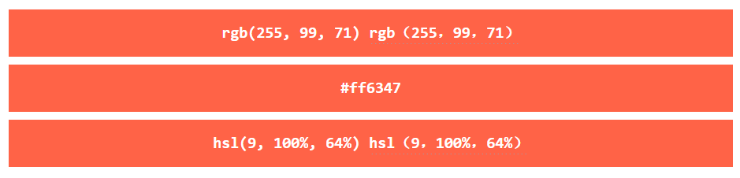

The following two \<div> elements have their background color set with RGBA and HSLA values, which add an Alpha channel to the color (here we have 50% transparency): &#x20;

以下两个元素的背景颜色设置为RGBA和HSLA值，这将为颜色添加一个Alpha通道（这里我们有50%的透明度）：

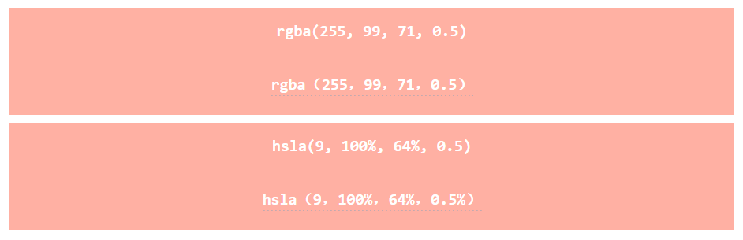

```html
<h1 style="background-color:rgb(255, 99, 71);">...</h1>
<h1 style="background-color:#ff6347;">...</h1>
<h1 style="background-color:hsl(9, 100%, 64%);">...</h1>

<h1 style="background-color:rgba(255, 99, 71, 0.5);">...</h1>
<h1 style="background-color:hsla(9, 100%, 64%, 0.5);">...</h1>
```

## `RGB`

An RGB color value represents RED, GREEN, and BLUE light sources. &#x20;

RGB颜色值表示红色、绿色和蓝色光源。

An RGBA color value is an extension of RGB with an Alpha channel (opacity). &#x20;

RGBA颜色值是具有Alpha通道（不透明度）的RGB的扩展。

### RGB Color Values

> 📌RGB颜色值

Each parameter (red, green, and blue) defines the intensity of the color with a value between 0 and 255. &#x20;

每个参数（红色、绿色和蓝色）定义颜色的强度，其值介于0和255之间。

This means that there are 256 x 256 x 256 = 16777216 possible colors! &#x20;

这意味着有256 x 256 x 256 = 16777216种可能的颜色！

For example, rgb(255, 0, 0) is displayed as red, because red is set to its highest value (255), and the other two (green and blue) are set to 0. &#x20;

例如，rgb（255，0，0）显示为红色，因为红色被设置为其最高值（255），而其他两个（绿色和蓝色）被设置为0。

Another example, rgb(0, 255, 0) is displayed as green, because green is set to its highest value (255), and the other two (red and blue) are set to 0. &#x20;

另一个例子，rgb（0，255，0）显示为绿色，因为绿色被设置为其最高值（255），而其他两个（红色和蓝色）被设置为0。

To display black, set all color parameters to 0, like this: rgb(0, 0, 0). &#x20;

要显示黑色，请将所有颜色参数设置为0，如下所示：rgb（0，0，0）。

To display white, set all color parameters to 255, like this: rgb(255, 255, 255). &#x20;

要显示白色，请将所有颜色参数设置为255，如下所示：rgb（255，255，255）.

Experiment by mixing the RGB values below: &#x20;

通过混合以下RGB值进行实验：

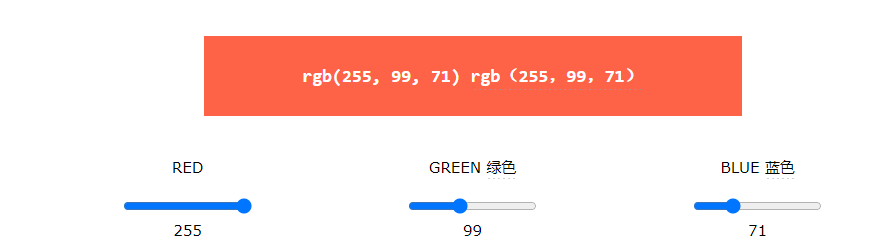

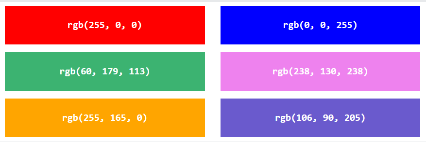

### Shades of Gray

> 📌灰色阴影

Shades of gray are often defined using equal values for all three parameters: &#x20;
灰色阴影通常使用所有三个参数的相等值来定义：

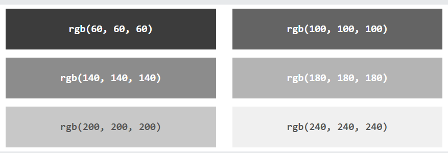

### RGBA Color Values

> 📌RGBA颜色值

RGBA color values are an extension of RGB color values with an Alpha channel - which specifies the opacity for a color. &#x20;

RGBA颜色值是具有Alpha通道的RGB颜色值的扩展-该通道指定颜色的不透明度。

An RGBA color value is specified with: &#x20;

RGBA颜色值指定为：

rgba(*red,* *green*, *blue, alpha*)

RGBA（红、绿色、蓝、阿尔法）

The alpha parameter is a number between 0.0 (fully transparent) and 1.0 (not transparent at all): &#x20;

alpha参数是一个介于0.0（完全透明）和1.0（完全不透明）之间的数字：

Experiment by mixing the RGBA values below: &#x20;

通过混合以下RGBA值进行实验：

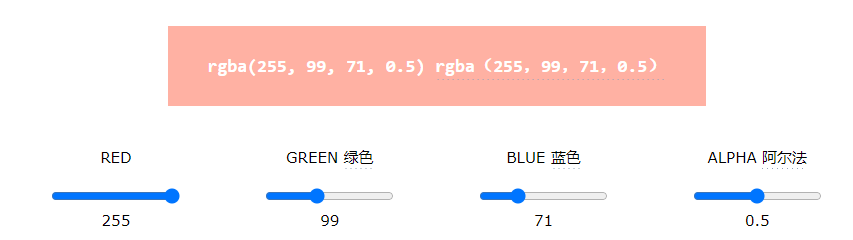

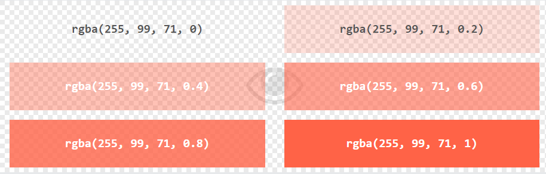

## `HEX`

> 📌十六进制颜色

A hexadecimal color is specified with: #RRGGBB, where the RR (red), GG (green) and BB (blue) hexadecimal integers specify the components of the color. &#x20;

十六进制颜色指定为：#RRGGBB，其中RR（红色）、GG（绿色）和BB（蓝色）十六进制整数指定颜色的分量。

### HEX Color Values

> 📌HEX颜色值

In HTML, a color can be specified using a hexadecimal value in the form: &#x20;

在HTML中，可以使用以下形式的十六进制值指定颜色：

\#*rrggbb*

Where rr (red), gg (green) and bb (blue) are hexadecimal values between 00 and ff (same as decimal 0-255). &#x20;

其中rr（红色），gg（绿色）和bb（蓝色）是00和ff之间的十六进制值（与十进制0-255相同）。

For example, #ff0000 is displayed as red, because red is set to its highest value (ff), and the other two (green and blue) are set to 00. &#x20;

例如，#ff0000显示为红色，因为红色设置为其最高值（ff），而其他两个（绿色和蓝色）设置为00。

Another example, #00ff00 is displayed as green, because green is set to its highest value (ff), and the other two (red and blue) are set to 00. &#x20;

另一个例子，#00ff00显示为绿色，因为绿色被设置为其最高值（ff），而其他两个（红色和蓝色）被设置为00。

To display black, set all color parameters to 00, like this: #000000. &#x20;

要显示黑色，请将所有颜色参数设置为00，如下所示：#000000.

To display white, set all color parameters to ff, like this: #ffffff. &#x20;

要显示白色，请将所有颜色参数设置为ff，如下所示：#ffffff。

Experiment by mixing the HEX values below: &#x20;

通过混合以下HEX值进行实验：

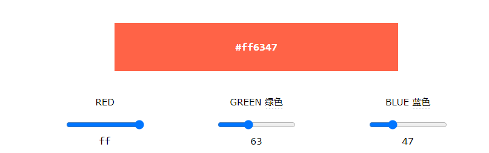

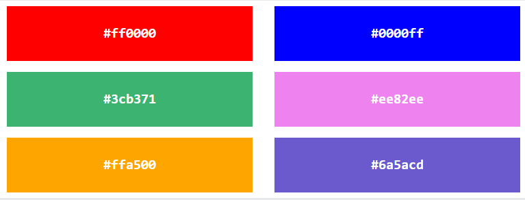

### Shades of Gray

> 📌灰色阴影

Shades of gray are often defined using equal values for all three parameters: &#x20;
灰色阴影通常使用所有三个参数的相等值来定义：

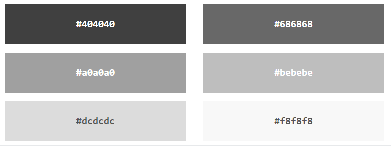

## `HSL`

HSL stands for hue, saturation, and lightness. &#x20;

HSL代表色调、饱和度和亮度。

HSLA color values are an extension of HSL with an Alpha channel (opacity). &#x20;

HSLA颜色值是具有Alpha通道（不透明度）的HSL的扩展。

### HSL Color Values

> 📌HSL颜色值

In HTML, a color can be specified using hue, saturation, and lightness (HSL) in the form: &#x20;

在HTML中，可以使用色调、饱和度和亮度（HSL）以如下形式指定颜色：

hsl(*hue*, *saturation*, *lightness*)

HSL（色调、饱和度、亮度）

Hue is a degree on the color wheel from 0 to 360. 0 is red, 120 is green, and 240 is blue. &#x20;

色调是色轮上从0到360的度数。0是红色，120是绿色，240是蓝色。

Saturation is a percentage value. 0% means a shade of gray, and 100% is the full color. &#x20;

饱和度是百分比值。0%表示灰色阴影，100%表示全色。

Lightness is also a percentage value. 0% is black, and 100% is white. &#x20;

亮度也是一个百分比值。0%是黑色，100%是白色。

Experiment by mixing the HSL values below: &#x20;

通过混合以下HSL值进行实验：


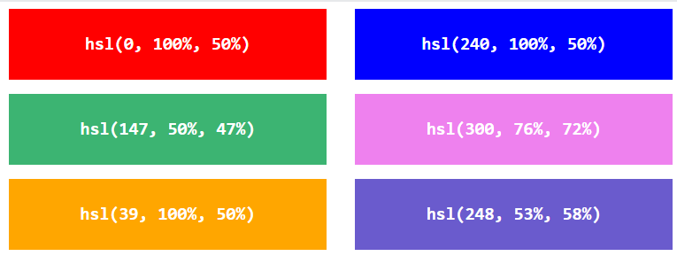

### Saturation

> 📌饱和度

Saturation can be described as the intensity of a color. &#x20;

饱和度可以被描述为颜色的强度。

100% is pure color, no shades of gray. &#x20;

100%是纯颜色，没有灰色阴影。

50% is 50% gray, but you can still see the color. &#x20;

50%是50%的灰色，但你仍然可以看到颜色。

0% is completely gray; you can no longer see the color. &#x20;

0%为完全灰色;你再也看不到颜色了。

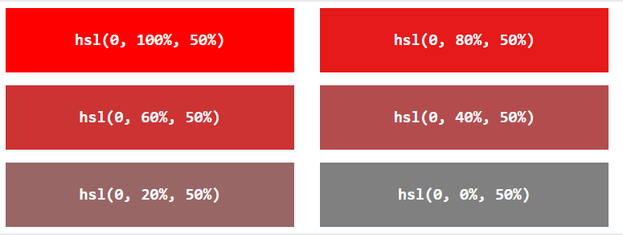

### Lightness

> 📌轻量化

The lightness of a color can be described as how much light you want to give the color, where 0% means no light (black), 50% means 50% light (neither dark nor light), and 100% means full lightness (white). &#x20;

颜色的亮度可以描述为你想要给予颜色多少亮度，其中0%表示没有光（黑色），50%表示50%的光（既不暗也不亮），100%表示全亮度（白色）

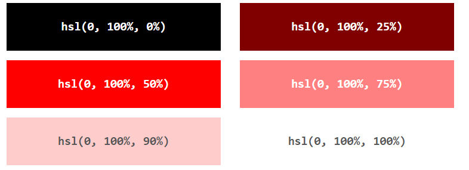

### Shades of Gray

> 📌灰色阴影

Shades of gray are often defined by setting the hue and saturation to 0, and adjusting the lightness from 0% to 100% to get darker/lighter shades: &#x20;

通常通过将色调和饱和度设置为0，并将亮度从0%调整到100%以获得更深/更浅的色调来定义灰色的阴影：

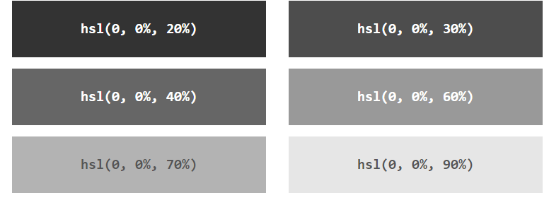

### HSLA Color Values

> 📌HSLA颜色值

HSLA color values are an extension of HSL color values, with an Alpha channel - which specifies the opacity for a color. &#x20;

HSLA颜色值是HSL颜色值的扩展，具有Alpha通道-指定颜色的不透明度。

An HSLA color value is specified with: &#x20;

HSLA颜色值指定为：

hsla(*hue,* *saturation*, *lightness, alpha*)

hsla（色调、饱和度、亮度、alpha）

The alpha parameter is a number between 0.0 (fully transparent) and 1.0 (not transparent at all): &#x20;

alpha参数是一个介于0.0（完全透明）和1.0（完全不透明）之间的数字：

Experiment by mixing the HSLA values below: &#x20;

通过混合以下HSLA值进行实验：

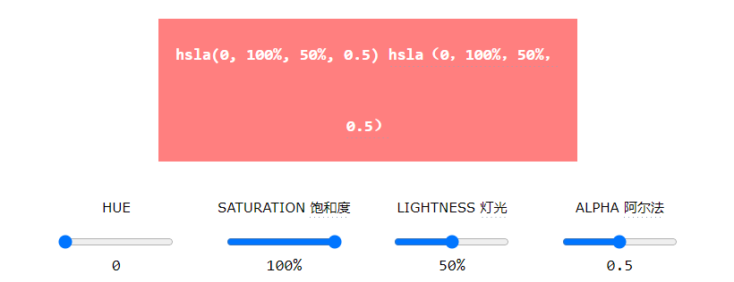

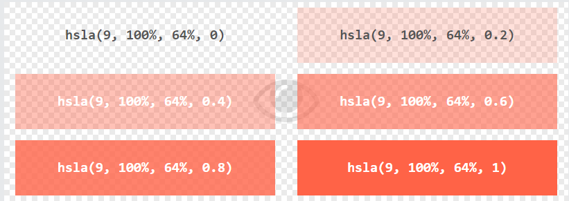
