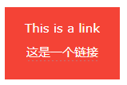

# Link  Colors

## 目录

-   [Link Colors](#Link-Colors)
-   [Link Buttons ](#Link-Buttons-)

> 📌链接颜色

An HTML link is displayed in a different color depending on whether it has been visited, is unvisited, or is active. &#x20;

HTML链接根据其是否已被访问、未被访问或处于活动状态而以不同的颜色显示。

# `Link Colors`

> 📌HTML链接颜色

By default, a link will appear like this (in all browsers): &#x20;
默认情况下，链接将显示如下（在所有浏览器中）：

-   An unvisited link is underlined and blue &#x20;

    未访问的链接会用下划线和蓝色
-   A visited link is underlined and purple &#x20;

    访问过的链接带有下划线和紫色
-   An active link is underlined and red &#x20;

    活动链接带有下划线和红色

You can change the link state colors, by using CSS: &#x20;

您可以使用CSS更改链接状态颜色：

Here, an unvisited link will be green with no underline. A visited link will be pink with no underline. An active link will be yellow and underlined. In addition, when mousing over a link (a:hover) it will become red and underlined: &#x20;

在这里，未访问的链接将是绿色的，没有下划线。访问过的链接将是粉红色的，没有下划线。活动链接将是黄色和下划线。此外，当鼠标在链接上（a：hover）时，它会变成红色并带有下划线：

```css
<style>
a:link {
  color: green;
  background-color: transparent;
  text-decoration: none;
}

a:visited {
  color: pink;
  background-color: transparent;
  text-decoration: none;
}

a:hover {
  color: red;
  background-color: transparent;
  text-decoration: underline;
}

a:active {
  color: yellow;
  background-color: transparent;
  text-decoration: underline;
}
</style>
```

# `Link Buttons `

> 📌链接按钮

A link can also be styled as a button, by using CSS: &#x20;

一个链接也可以被设计成一个按钮，通过使用CSS：



```html
<style>
a:link, a:visited {
  background-color: #f44336;
  color: white;
  padding: 15px 25px;
  text-align: center;
  text-decoration: none;
  display: inline-block;
}

a:hover, a:active {
  background-color: red;
}
</style>
```

> 📌To learn more about CSS, go to our [CSS Tutorial](https://www.w3schools.com/css/default.asp "CSS Tutorial").要了解更多关于CSS的信息，请访问我们的CSS教程。
