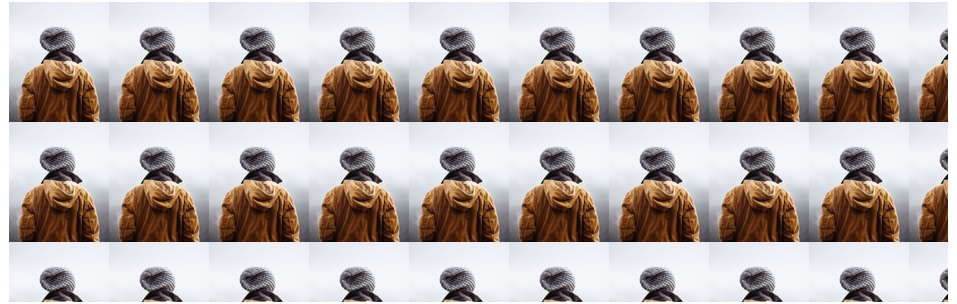

# Background Images

## 目录

-   [Background Image on a HTML element](#Background-Image-on-a-HTML-element)
-   [Background Image on a Page](#Background-Image-on-a-Page)
-   [Background Repeat](#Background-Repeat)
-   [Background Cover](#Background-Cover)
-   [Background Stretch](#Background-Stretch)

> 📌HTML背景图片

A background image can be specified for almost any HTML element. &#x20;

背景图像可以为几乎任何HTML元素指定。

# `Background Image on a HTML element`

> 📌HTML元素上的背景图像

To add a background image on an HTML element, use the HTML `style` attribute and the CSS `background-image` property:

要在HTML元素上添加背景图像，请使用HTML `style` 属性和CSS `background-image` 属性：

Add a background image on a HTML element: &#x20;

在HTML元素上添加背景图像：

```html
<p style="background-image: url('img_girl.jpg');">
```

You can also specify the background image in the `<style>` element, in the `<head>` section:

您也可以在 `<head>` 部分的 `<style>` 元素中指定背景图像：

Specify the background image in the `<style>` element:

在 `<style>` 元素中指定背景图像：

```html
<style>
p {
  background-image: url('img_girl.jpg');
}
</style>
```

# `Background Image on a Page`

> 📌页面上的背景图像

If you want the entire page to have a background image, you must specify the background image on the `<body>` element:

如果希望整个页面都有背景图像，则必须在 `<body>` 元素上指定背景图像：

Add a background image for the entire page: &#x20;

为整个页面添加背景图像：

```html
<style>
body {
  background-image: url('img_girl.jpg');
}
</style>
```

# `Background Repeat`

> 📌背景重复

If the background image is smaller than the element, the image will repeat itself, horizontally and vertically, until it reaches the end of the element: &#x20;

如果背景图像小于元素，图像将重复自身，水平和垂直，直到它到达元素的末尾：



```html
<style>
body {
  background-image: url('example_img_girl.jpg');
}
</style>
```

To avoid the background image from repeating itself, set the `background-repeat` property to `no-repeat`.

要避免背景图像重复，请将 `background-repeat` 属性设置为 `no-repeat` 。

```html
<style>
body {
  background-image: url('example_img_girl.jpg');
  background-repeat: no-repeat;
}
</style>
```

# `Background Cover`

> 📌背景封面

If you want the background image to cover the entire element, you can set the `background-size` property to `cover.`

如果希望背景图像覆盖整个元素，可以将 `background-size` 属性设置为 `cover.`

Also, to make sure the entire element is always covered, set the `background-attachment` property to `fixed:`

此外，要确保始终覆盖整个元素，请将 `background-attachment` 属性设置为 `fixed:`

This way, the background image will cover the entire element, with no stretching (the image will keep its original proportions): &#x20;

这样，背景图像将覆盖整个元素，没有拉伸（图像将保持其原始比例）：

```html
<style>
body {
  background-image: url('img_girl.jpg');
  background-repeat: no-repeat;
  background-attachment: fixed;
  background-size: cover;
}
</style>
```

# `Background Stretch`

> 📌背景拉伸

If you want the background image to stretch to fit the entire element, you can set the `background-size` property to `100% 100%`:

如果希望背景图像拉伸以适应整个元素，可以将 `background-size` 属性设置为 `100% 100%` ：


Try resizing the browser window, and you will see that the image will stretch, but always cover the entire element. &#x20;

尝试调整浏览器窗口的大小，您将看到图像将拉伸，但始终覆盖整个元素。

```html
<style>
body {
  background-image: url('img_girl.jpg');
  background-repeat: no-repeat;
  background-attachment: fixed;
  background-size: 100% 100%;
}
</style>
```
