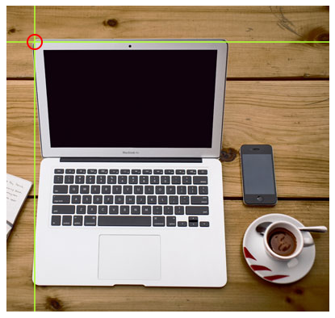
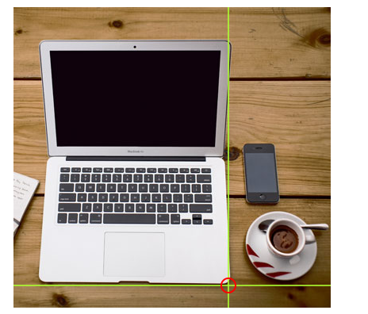
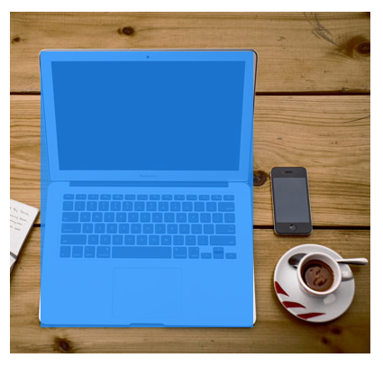
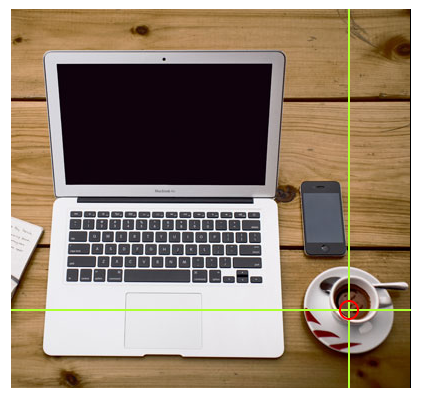
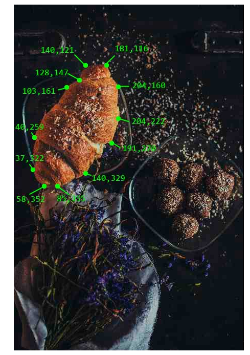
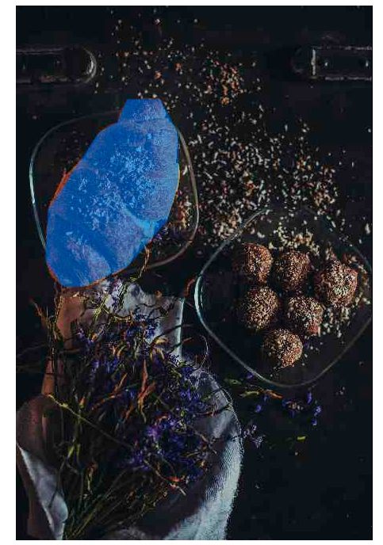

# Image Map

## 目录

-   [Chapter Summary ](#Chapter-Summary-)
-   [Image Maps](#Image-Maps)
-   [How Does it Work?](#How-Does-it-Work)
-   [The Image](#The-Image)
-   [Create Image Map](#Create-Image-Map)
-   [The Areas](#The-Areas)
    -   [Shape 造型](#Shape-造型)
    -   [Shape="rect" ](#Shaperect-)
    -   [Shape="circle" ](#Shapecircle-)
    -   [Shape="poly" ](#Shapepoly-)
-   [Image Map and JavaScript](#Image-Map-and-JavaScript)

> 📌图像映射

| Tag                                                                      | Description                                      |
| ------------------------------------------------------------------------ | ------------------------------------------------ |
| [\](https://www.w3schools.com/tags/tag_img.asp "")             | Defines an image                                 |
| [\<map>](https://www.w3schools.com/tags/tag_map.asp "<map>")             | Defines an image map                             |
| [\<area>](https://www.w3schools.com/tags/tag_area.asp "<area>")          | Defines a clickable area inside an image map     |
| [\<picture>](https://www.w3schools.com/tags/tag_picture.asp "<picture>") | Defines a container for multiple image resources |

# Chapter Summary&#x20;

> 📌章节摘要

-   Use the HTML `<map>` element to define an image map &#x20;

    使用HTML `<map>` 元素定义图像映射
-   Use the HTML `<area>` element to define the clickable areas in the image map &#x20;

    使用HTML `<area>` 元素定义图像映射中的可点击区域
-   Use the HTML `usemap` attribute of the `` element to point to an image map &#x20;

    使用 `` 元素的HTML `usemap` 属性指向图像映射

With HTML image maps, you can create clickable areas on an image. &#x20;

使用HTML图像映射，您可以在图像上创建可单击区域。

# `Image Maps`

> 📌图像地图

The HTML `<map>` tag defines an image map. An image map is an image with clickable areas. The areas are defined with one or more `<area>` tags.The HTML `<map>` tag defines an image map

定义一个map图像。.一张可点击区域的图像。（这个区域被定义为一个或更多）

Try to click on the computer, phone, or the cup of coffee in the image below: &#x20;

尝试点击计算机，电话，或下图中的咖啡杯：


Here is the HTML source code for the image map above: &#x20;

这里是图像的HTML源代码

```html


<map name="workmap">
  <area shape="rect" coords="34,44,270,350" alt="Computer" href="computer.htm">
  <area shape="rect" coords="290,172,333,250" alt="Phone" href="phone.htm">
  <area shape="circle" coords="337,300,44" alt="Coffee" href="coffee.htm">
</map>
```

# `How Does it Work?`

> 📌如何工作的

The idea behind an image map is that you should be able to perform different actions depending on where in the image you click. &#x20;

图像映射背后的想法是，您应该能够执行不同的操作，这取决于您在图像中单击的位置。

To create an image map you need an image, and some HTML code that describes the clickable areas. &#x20;

要创建图像映射，您需要一个图像和一些描述可单击区域的HTML代码。

# `The Image`

> 📌图像

The image is inserted using the `` tag. The only difference from other images is that you must add a `usemap` attribute:

使用 `` 标签插入图像。与其他图像的唯一区别是您必须添加 `usemap` 属性：

```html

```

The `usemap` value starts with a hash tag `#` followed by the name of the image map, and is used to create a relationship between the image and the image map.

`usemap` 值以散列标签 `#` 开始，后跟图像映射的名称，用于创建图像和图像映射之间的关系。

> 📌**Tip:** You can use any image as an image map!提示：您可以使用任何图像作为图像映射！

# `Create Image Map`

> 📌创建图像映射

Then, add a \<map> element.

然后，添加 \<map> 元素。

The \<map> element is used to create an image map, and is linked to the image by using the required name attribute:

\<map> 元素用于创建图像映射，并通过所需的 name 属性链接到图像：

```html
<map name="workmap">
```

The `name` attribute must have the same value as the ``'s `usemap` attribute .

`name` 属性必须与 `` 的 `usemap` 属性具有相同的值。

# `The Areas`

> 📌地区

Then, add the clickable areas. &#x20;

然后，添加可单击区域。

A clickable area is defined using an `<area>` element.

可点击区域使用 `<area>` 元素定义。

## `Shape 造型`

You must define the shape of the clickable area, and you can choose one of these values: &#x20;

您必须定义可单击区域的形状，并且可以选择以下值之一：

-   `rect` - defines a rectangular region &#x20;

    `rect` —定义矩形区域
-   `circle` - defines a circular region &#x20;

    `circle` —定义循环区域
-   `poly` - defines a polygonal region &#x20;

    `poly` -定义多边形区域
-   `default` - defines the entire region &#x20;

    `default` -定义整个区域

You must also define some coordinates to be able to place the clickable area onto the image.  &#x20;

您还必须定义一些坐标，以便能够将可点击区域放置到图像上。

## `Shape="rect" `

> 📌形状=“矩形”

The coordinates for `shape="rect"` come in pairs, one for the x-axis and one for the y-axis.

`shape="rect"` 的坐标成对出现，一个用于x轴，一个用于y轴。

So, the coordinates `34,44` is located 34 pixels from the left margin and 44 pixels from the top:

因此，坐标 `34,44` 位于距左边距34像素和距顶部44像素处：



The coordinates `270,350` is located 270 pixels from the left margin and 350 pixels from the top:

坐标 `270,350` 位于距左边距270像素和距顶部350像素处：



Now we have enough data to create a clickable rectangular area: &#x20;

现在我们有足够的数据来创建一个可点击的矩形区域：

```html
<area shape="rect" coords="34, 44, 270, 350" href="computer.htm">
```

This is the area that becomes clickable and will send the user to the page "computer.htm": &#x20;

这是可点击的区域，并将用户发送到“computer.htm”页面：



## `Shape="circle" `

> 📌形状=“圆形”

To add a circle area, first locate the coordinates of the center of the circle:

要添加圆区域，请首先定位圆心的坐标：

337,300



Then specify the radius of the circle: &#x20;

然后指定圆的半径：

`44` pixels&#x20;

`44` 像素


Now you have enough data to create a clickable circular area: &#x20;

现在你有足够的数据来创建一个可点击的圆形区域：

```html
<area shape="circle" coords="337, 300, 44" href="coffee.htm">
```

This is the area that becomes clickable and will send the user to the page "coffee.htm": &#x20;

这是可点击的区域，并将用户发送到“coffee.htm”页面：


## `Shape="poly" `

> 📌形状=“多边形”

The `shape="poly"` contains several coordinate points, which creates a shape formed with straight lines (a polygon).

`shape="poly"` 包含几个坐标点，这些坐标点创建了一个由直线形成的形状（多边形）。

This can be used to create any shape. &#x20;

它可以用来创建任何形状。

Like maybe a croissant shape! &#x20;

就像羊角面包的形状！

How can we make the croissant in the image below become a clickable link? &#x20;

我们怎样才能使下图中的羊角面包成为一个可点击的链接？


We have to find the x and y coordinates for all edges of the croissant: &#x20;

我们必须找到羊角面包所有边的x和y坐标：



The coordinates come in pairs, one for the x-axis and one for the y-axis: &#x20;

坐标成对出现，一个用于x轴，一个用于y轴：

```html
<area shape="poly" coords="140,121,181,116,204,160,204,222,191,270,140,329,85,355,58,352,37,322,40,259,103,161,128,147" href="croissant.htm">
```

This is the area that becomes clickable and will send the user to the page "croissant.htm": &#x20;

这是可点击的区域，并将用户发送到页面“croissant.htm”：



# `Image Map and JavaScript`

A clickable area can also trigger a JavaScript function. &#x20;

一个可点击的区域也可以触发一个JavaScript函数。

Add a `click` event to the `<area>` element to execute a JavaScript function:

在 `<area>` 元素中添加 `click` 事件以执行JavaScript函数：

Here, we use the onclick attribute to execute a JavaScript function when the area is clicked: &#x20;

在这里，我们使用onclick属性在区域被点击时执行JavaScript函数：

```html
<map name="workmap">
  <area shape="circle" coords="337,300,44" href="coffee.htm" onclick="myFunction()">
</map>

<script>
function myFunction() {
  alert("You clicked the coffee cup!");
}
</script>
```
