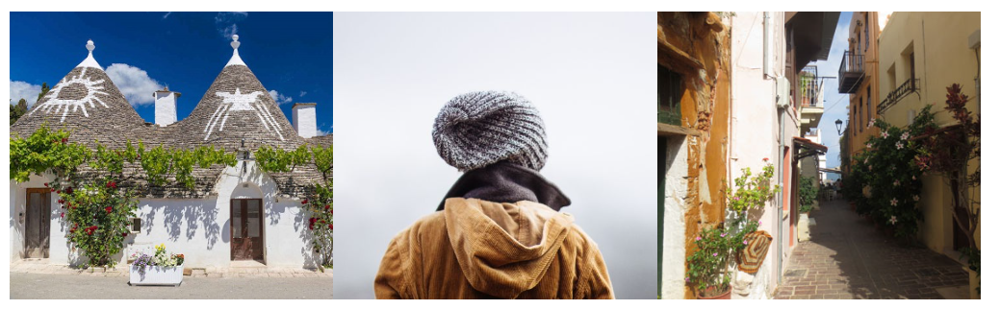

# Images

## 目录

-   [Chapter Summary](#Chapter-Summary)
-   [Images Syntax](#Images-Syntax)
-   [The src Attribute](#The-src-Attribute)
-   [The alt Attribute](#The-alt-Attribute)
-   [Image Size - Width and Height](#Image-Size---Width-and-Height)
-   [Width and Height, or Style?](#Width-and-Height-or-Style)
-   [Images in Another Folder](#Images-in-Another-Folder)
-   [Images on Another Server/Website](#Images-on-Another-ServerWebsite)
-   [Animated Images](#Animated-Images)
-   [Image as a Link](#Image-as-a-Link)
-   [Image Floating](#Image-Floating)
-   [Common Image Formats](#Common-Image-Formats)

> 📌HTML图像

# Chapter Summary

> 📌章节摘要

-   Use the HTML `` element to define an image  

    使用HTML `` 元素定义图像
-   Use the HTML `src` attribute to define the URL of the image  

    使用HTML `src` 属性定义图像的URL
-   Use the HTML `alt` attribute to define an alternate text for an image, if it cannot be displayed 

    使用HTML `alt` 属性为无法显示的图像定义替换文本
-   Use the HTML `width` and `height` attributes or the CSS `width` and `height` properties to define the size of the image  

    使用HTML `width` 和 `height` 属性或CSS `width` 和 `height` 属性定义图像的大小
-   Use the CSS `float` property to let the image float to the left or to the right  

    使用CSS `float` 属性让图像向左或向右浮动
-   图像格式

Images can improve the design and the appearance of a web page.  

图像可以改善网页的设计和外观。



```html

```

```html

```

```html

```

# `Images Syntax`

> 📌图像语法

The HTML `` tag is used to embed an image in a web page.

HTML `` 标签用于在网页中嵌入图像。

Images are not technically inserted into a web page; images are linked to web pages. The `` tag creates a holding space for the referenced image.

图像在技术上不会插入到网页中;图像链接到网页。 `` 标记为引用图像创建了一个保持空间。

The `` tag is empty, it contains attributes only, and does not have a closing tag.

`` 标记为空，它只包含属性，并且没有结束标记。

The `` tag has two required attributes:`` 标签有两个必需的属性：

-   src - Specifies the path to the image  

    src -指定图像的路径
-   alt - Specifies an alternate text for the image  

    alt -指定图像的替代文本

```html

```

# `The src Attribute`

> 📌src属性

The required `src` attribute specifies the path (URL) to the image.

必需的 `src` 属性指定图像的路径（URL）。

> 📌**Note:** When a web page loads, it is the browser, at that moment, that gets the image from a web server and inserts it into the page. Therefore, make sure that the image actually stays in the same spot in relation to the web page, otherwise your visitors will get a broken link icon.注意：当网页加载时，是浏览器从Web服务器获取图像并将其插入页面。因此，请确保图像实际上停留在与网页相关的同一位置，否则您的访问者将得到一个断开的链接图标。The broken link icon and the `alt` text are shown if the browser cannot find the image.如果浏览器找不到图像，则会显示断开链接图标和 `alt` 文本。

```html

```

# `The alt Attribute`

> 📌alt属性

The required `alt` attribute provides an alternate text for an image, if the user for some reason cannot view it (because of slow connection, an error in the src attribute, or if the user uses a screen reader).

如果用户由于某种原因（由于连接速度慢、src属性错误或用户使用屏幕阅读器）无法查看图像，则需要的 `alt` 属性为图像提供替代文本。

The value of the `alt` attribute should describe the image:

`alt` 属性的值应描述图像：

```html

```

If a browser cannot find an image, it will display the value of the `alt` attribute:

如果浏览器找不到图像，它将显示 `alt` 属性的值：

```html

```

> 📌**Tip:** A screen reader is a software program that reads the HTML code, and allows the user to "listen" to the content. Screen readers are useful for people who are visually impaired or learning disabled.提示：屏幕阅读器是一个软件程序，它可以读取HTML代码，并允许用户“听”到内容。屏幕阅读器对视力障碍或学习障碍的人很有用。

# `Image Size - Width and Height`

> 📌宽度和高度

You can use the `style` attribute to specify the width and height of an image.

您可以使用 `style` 属性指定图像的宽度和高度。

```html

```

Alternatively, you can use the `width` and `height` attributes:

或者，您可以使用 `width` 和 `height` 属性：

```html

```

The width and height attributes always define the width and height of the image in pixels.

width 和 height 属性始终以像素为单位定义图像的宽度和高度。

> 📌**Note:** Always specify the width and height of an image. If width and height are not specified, the web page might flicker while the image loads.注意：始终指定图像的宽度和高度。如果未指定宽度和高度，则加载图像时网页可能会闪烁。

# `Width and Height, or Style?`

> 📌宽度，高度还是样式？

The `width`, `height`, and `style` attributes are all valid in HTML.

`width` 、 `height` 和 `style` 属性在HTML中都是有效的。

However, we suggest using the `style` attribute. It prevents styles sheets from changing the size of images:

但是，我们建议使用 `style` 属性。它可以防止样式表更改图像的大小：

```html
<!DOCTYPE html>
<html>
<head>
<style>
img {
  width: 100%;
}
</style>
</head>
<body>


</body>
</html>
```

# `Images in Another Folder`

> 📌图像在其他文件夹

If you have your images in a sub-folder, you must include the folder name in the `src` attribute:

如果子文件夹中有图像，则必须在 `src` 属性中包含文件夹名称：

```html

```

# `Images on Another Server/Website`

> 📌图像在其他服务器或网站

Some web sites point to an image on another server. &#x20;

一些网站指向另一台服务器上的图像。

To point to an image on another server, you must specify an absolute (full) URL in the `src` attribute:

要指向其他服务器上的图像，必须在 `src` 属性中指定绝对（完整）URL：

```html

```

> 📌**Notes on external images:** External images might be under copyright. If you do not get permission to use it, you may be in violation of copyright laws. In addition, you cannot control external images; they can suddenly be removed or changed.外部图像注释：外部图像可能受版权保护。如果您没有获得许可使用它，您可能会违反版权法。此外，你不能控制外部图像;它们可以突然被移除或改变。

# `Animated Images`

> 📌动画图像

HTML allows animated GIFs: &#x20;

HTML允许动画GIF：

```html

```

# `Image as a Link`

> 📌图像作为链接

To use an image as a link, put the `` tag inside the `<a>` tag:

要使用图像作为链接，请将 `` 标记放在 `<a>` 标记内：

```html
<a href="default.asp">
  
</a>
```

# `Image Floating`

> 📌图像浮动

Use the CSS `float` property to let the image float to the right or to the left of a text:

使用CSS `float` 属性让图像浮动到文本的右侧或左侧：

```html
<p>
The image will float to the right of the text.</p>

<p>
The image will float to the left of the text.</p>
```

> 📌**Tip:** To learn more about CSS Float, read our [CSS Float Tutorial](https://www.w3schools.com/css/css_float.asp "CSS Float Tutorial").提示：要了解更多关于CSS Float的信息，请阅读我们的CSS Float教程。

# `Common Image Formats`

> 📌图像格式

Here are the most common image file types, which are supported in all browsers (Chrome, Edge, Firefox, Safari, Opera): &#x20;

以下是所有浏览器（Chrome，Edge，Firefox，Safari，Opera）支持的最常见的图像文件类型：

| Abbreviation | File Format                           | File Extension                   |
| ------------ | ------------------------------------- | -------------------------------- |
| APNG         | Animated Portable Network Graphics    | .apng                            |
| GIF          | Graphics Interchange Format           | .gif                             |
| ICO          | Microsoft Icon                        | .ico, .cur                       |
| JPEG         | Joint Photographic Expert Group image | .jpg, .jpeg, .jfif, .pjpeg, .pjp |
| PNG          | Portable Network Graphics             | .png                             |
| SVG          | Scalable Vector Graphics              | .svg                             |

> 📌**Note:** Loading large images takes time, and can slow down your web page. Use images carefully.注意：加载大图像需要时间，并且可能会降低您的网页速度。小心使用图像。
