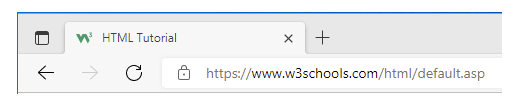

# H5-Favicon

## 目录

-   [Chapter Summary](#Chapter-Summary)
-   [How To Add a Favicon in HTML](#How-To-Add-a-Favicon-in-HTML)
-   [Favicon File Format Support](#Favicon-File-Format-Support)

> 📌HTML图标

建议网站：[https://www.iconfont.cn/](https://www.iconfont.cn/ "https://www.iconfont.cn/")

# Chapter Summary

> 📌章节摘要

A favicon is a small image displayed next to the page title in the browser tab. &#x20;

favicon是显示在浏览器选项卡中页面标题旁边的小图像。

# `How To Add a Favicon in HTML`

> 📌如何在HTML中添加Favicon

You can use any image you like as your favicon. You can also create your own favicon on sites like [https://www.favicon.cc](https://www.favicon.cc/ "https://www.favicon.cc").

您可以使用任何您喜欢的图像作为您的favicon。你也可以在https\://www\.favicon.cc这样的网站上创建自己的favicon。

> 📌**Tip:** A favicon is a small image, so it should be a simple image with high contrast.提示：favicon是一个小图像，所以它应该是一个具有高对比度的简单图像。

A favicon image is displayed to the left of the page title in the browser tab, like this: &#x20;

浏览器选项卡中页面标题的左侧会显示一个favicon图像，如下所示：



To add a favicon to your website, either save your favicon image to the root directory of your webserver, or create a folder in the root directory called images, and save your favicon image in this folder. A common name for a favicon image is "favicon.ico". &#x20;

要添加一个图标到您的网站，要么保存您的图标图像到您的网站服务器的根目录，或创建一个文件夹在根目录称为图像，并保存您的图标图像在此文件夹。favicon.ico的常见名称是“favicon.ico”。

Next, add a `<link>` element to your "index.html" file, after the `<title>` element, like this:

接下来，在“index.html”文件中的 `<title>` 元素之后添加一个 `<link>` 元素，如下所示：

```html
<!DOCTYPE html>
<html>
<head>
  <title>My Page Title</title>
  <link rel="icon" type="image/x-icon" href="/images/favicon.ico">
</head>
<body>

<h1>This is a Heading</h1>
<p>This is a paragraph.</p>

</body>
</html>
```

Now, save the "index.html" file and reload it in your browser. Your browser tab should now display your favicon image to the left of the page title. &#x20;

现在，保存“index.html”文件并将其重新加载到浏览器中。您的浏览器选项卡现在应该会在页面标题的左侧显示您的图标图像。

# `Favicon File Format Support`

> 📌Favicon文件格式支持

The following table shows the file format support for a favicon image: &#x20;
下表显示了对favicon图像的文件格式支持：

| Browser | ICO | PNG | GIF | JPEG | SVG |
| ------- | --- | --- | --- | ---- | --- |
| Edge    | Yes | Yes | Yes | Yes  | Yes |
| Chrome  | Yes | Yes | Yes | Yes  | Yes |
| Firefox | Yes | Yes | Yes | Yes  | Yes |
| Opera   | Yes | Yes | Yes | Yes  | Yes |
| Safari  | Yes | Yes | Yes | Yes  | Yes |
