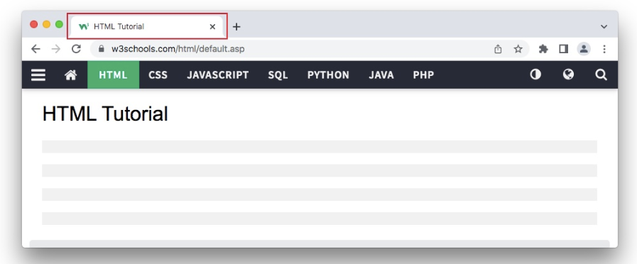

# H5-Page Title

> 📌页面标题

| Tag                                                                | Description                       |
| ------------------------------------------------------------------ | --------------------------------- |
| [\<title>](https://www.w3schools.com/tags/tag_title.asp "<title>") | Defines the title of the document |

Every web page should have a page title to describe the meaning of the page. &#x20;

每个网页都应该有一个页面标题来描述页面的含义。

The `<title>` element adds a title to your page:

`<title>` 元素会为页面添加标题：

```html
<!DOCTYPE html>
<html>
<head>
  <title>HTML Tutorial</title>
</head>
<body>

The content of the document......

</body>
</html>
```

The title is shown in the browser's title bar: &#x20;

标题显示在浏览器的标题栏中：



The title should describe the content and the meaning of the page. &#x20;

标题应该描述页面的内容和含义。

The page title is very important for search engine optimization (SEO). The text is used by search engine algorithms to decide the order when listing pages in search results. &#x20;

页面标题对于搜索引擎优化（SEO）非常重要。搜索引擎算法使用文本来决定在搜索结果中列出页面的顺序。

The `<title>` element: `<title>` 元素：

-   defines a title in the browser toolbar &#x20;

    在浏览器工具栏中定义标题
-   provides a title for the page when it is added to favorites &#x20;

    当页面添加到收藏夹时，提供页面的标题
-   displays a title for the page in search engine-results &#x20;

    在搜索引擎结果中显示页面标题

So, try to make the title as accurate and meaningful as possible! &#x20;

所以，尽量使标题准确和有意义！
